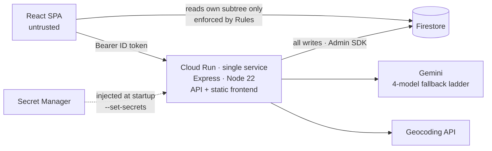
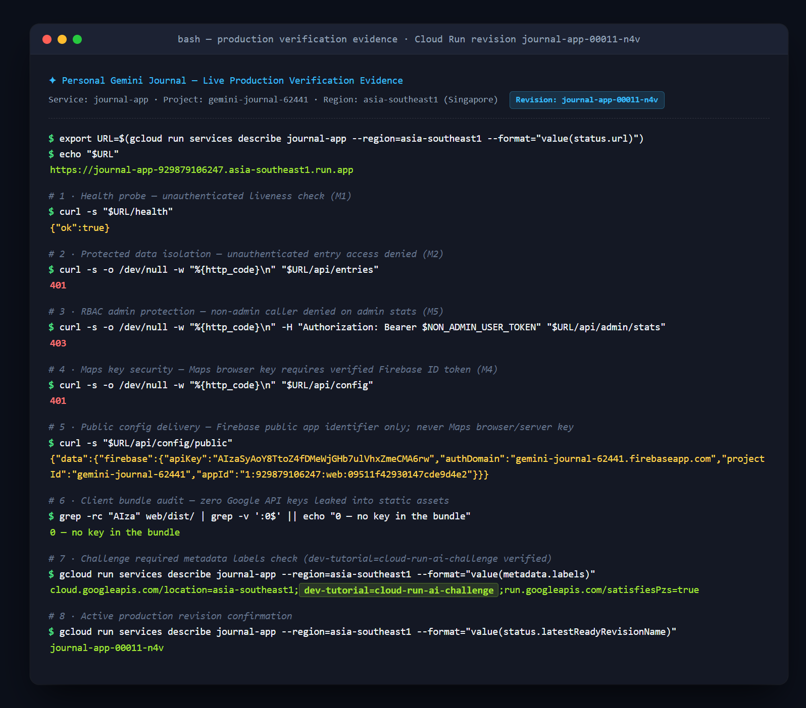
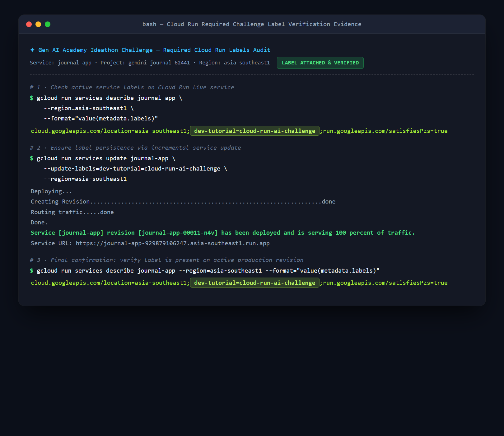

# Personal Gemini Journal — *Mood Cartography*

> An authenticated AI journaling app. Talk through your day with Gemini across multiple turns; each
> session is automatically summarized, mood-scored, optionally geo-tagged, and stored privately in
> Cloud Firestore — then drawn as a map of your moods across **time and place**.
>
> Gen AI Academy (APAC) · Ideathon Challenge submission

**Live URL**: `https://journal-app-929879106247.asia-southeast1.run.app`  
**GCP Project**: `gemini-journal-62441`  
**Region**: `asia-southeast1` (Singapore)

---

## The constraint that shaped everything

**The challenge requires API keys to be retrieved from Google Cloud Secret Manager. Secret Manager is reachable only from a server. So this cannot be a client-side application.**

Every architectural decision follows from that one line. The browser signs in and reads its own data. Calling Gemini, writing to Firestore, and reading secrets all happen inside Cloud Run.



One Cloud Run service hosts both `/api/*` and the static build: same origin so no CORS, one deploy target, and no ambiguity about which service carries the challenge label.

---

## Core requirements

| Requirement | Implementation | How to verify |
|---|---|---|
| **User Authentication** | Firebase Auth, Google Sign-In only. No password is ever handled, stored, or logged. | `GET /api/entries` without a token → `401` |
| **Multi-turn AI Interaction** | Server-side `@google/genai` through a `generateContentWithFallback` ladder. Conversation history in Firestore with a hard turn cap. | Chat across several turns, sign out and back in — history persists |
| **Isolated Data Storage** | `users/{uid}/**` subcollection layout. All client writes denied; reads scoped by Rules to `request.auth.uid == uid`. | Rules test suite includes cross-user negative cases |
| **Secure Key Management** | Three keys in Secret Manager, injected at instance startup via Cloud Run `--set-secrets`. | `grep -c "AIza"` over the built bundle → `0` |

---

## Feature enhancements

Three features, one idea: **your moods have a timeline and a geography.**

### 1 · Mood tracking and trend dashboard — the time axis

When a session is finalized, Gemini returns structured output — `{ mood, moodScore, moodReason, tags }` — via `responseSchema`, and that result is **re-validated with Zod** before it reaches Firestore. The dashboard renders a mood line chart, a distribution donut, and tag frequency with Recharts.

Hovering any point reveals its `moodReason`. An AI mood score that cannot explain itself gives the user no reason to trust it.

### 2 · Location-aware entries (Google Maps) — the space axis

Entries can carry a location, and map markers are **colored by mood**. "Everything I write at the office is blue" becomes something you can actually see.

Three privacy controls, all required: **opt-in by default** (geolocation is never requested on page load), **precision degradation** (all coordinates are systematically truncated to 2 decimal places, ~1.1 km city-level precision), and **revocability** (a bulk clear that writes an audit entry).

Reverse geocoding runs server-side, and **any `placeName` or `geohash` supplied by the client is discarded and recomputed**. Trusting them would let a user claim any location and forge every location-based aggregate.

### 3 · RBAC admin dashboard — the population view

Admins see platform-wide mood trends. **Admins cannot read a single journal entry.**

That is a deliberate trade-off, not a missing feature. An admin dashboard that reads everyone's diary takes thirty minutes to build and is a privacy incident. The real engineering problem is delivering population-level insight while being *structurally incapable* of reading content — answered with a de-identified `aggregates/*` layer, plus small-sample suppression when a day has fewer than 5 active users.

This is enforced in `firestore.rules`, not by backend convention. A negative test proves it: **a token carrying `role: "admin"` is denied on `users/A/entries/e1`.**

---

## Security design

### Seven places this tightens the baseline

The project starts from the challenge's Production Directives and goes further in seven specific places:

| # | Baseline | This project | Why |
|---|---|---|---|
| 1 | `allow read, write: if request.auth.uid == userId` — clients may write | **`allow write: if false`**; every write goes through the backend Admin SDK | Only a server-mediated write can strip client-forged fields, validate model output, and enforce rate limits |
| 2 | Implied flat collection | `users/{uid}/entries/*` **subcollection layout** | Flat layout makes isolation depend on every query remembering its filter — one omission is a breach. Subcollections make cross-user access fail at the path level |
| 3 | No catch-all | Explicit **default deny** — `match /{document=**} { allow read, write: if false; }` | A new collection with a forgotten rule must be unreachable, not open |
| 4 | RBAC may use claims **or** document lookups | **Custom claims only** | A claim lives inside a signed token and cannot be forged; a lookup costs a read per rule evaluation and inherits the trust of that document's write rules |
| 5 | Not addressed | **Admins see aggregates, never content** | An admin dashboard exposing diary content is a privacy breach |
| 6 | Compute Engine default service account | **Dedicated least-privilege SA**, `secretAccessor` bound **per secret** | Project-level binding grants read access to every secret added to the project in future |
| 7 | Use `responseSchema` | **Model output treated as untrusted input**, re-validated with Zod before any write | Structured output is best-effort, not a security boundary |

Every one of these has a corresponding negative test, and each can be demonstrated live as an attack that fails.

### Key defenses

| Defense | Mechanism |
|---|---|
| **Identity cannot be forged** | Authorization uses only the `uid` from `verifyIdToken(token, true)`. A `uid`, `role`, or `email` in a request body is never trusted |
| **Roles cannot be forged** | Roles live in Firebase custom claims, inside the signed token. The `role` field in Firestore is a display mirror and is never read for an authorization decision |
| **Writes cannot be forged** | All client writes denied. Server writes pass through Zod; `uid`, `role`, timestamps, and mood scores are stripped unconditionally before write |
| **Model output is untrusted** | `responseSchema` is not a boundary — every model response is re-parsed through Zod before storage |
| **Prompt injection** | User text is delimited in `<transcript>` tags and declared as data to analyze. More importantly, **model output never determines a Firestore path, a target user, a recipient, or a tool call** — that is the layer that actually holds |
| **Audit trail** | Role changes and admin queries write to `audit_logs`, which denies all client access. An audit log an admin can edit is not an audit log |
| **Cost as availability** | Every model-backed route is rate-limited per uid with hard caps on input length, output tokens, and history turns |

### An honest note about two kinds of key

**The Firebase Web config (including `apiKey`) is a public identifier, not a credential.** It ships in the client by design; its protection is Firestore Rules plus App Check. We do not pretend it is a secret.

`GET /api/config/public` serves that identifier and nothing else. It has no fallback chain into another environment variable — a fallback is exactly how a restricted, billable key ends up on an unauthenticated endpoint wearing the wrong name, and how a misconfigured referrer restriction stays invisible. If the identifier is unset the endpoint returns `503`, and in production the server refuses to start at all.

**The Maps JavaScript API browser key must exist in the browser and cannot be hidden.** Rather than pretending otherwise, we demote it to a key that is useless even if extracted: stored in Secret Manager, delivered **at runtime** from an authenticated `GET /api/config` (never inlined at build time), restricted by HTTP referrer, limited to the Maps JavaScript API alone, and capped by daily quota. The valuable Geocoding key is a **separate** key that never leaves the Cloud Run process.

> Secret management is not "put everything in Secret Manager". It is deciding, for each key, the lowest layer it must be exposed to — and applying the right restriction at that layer.

### One security constitution across three AI development environments

The Phase 1 security directives were configured in Google AI Studio's Custom Instructions and used to generate the initial implementation. Development then moved into Google Antigravity and Claude Code along the officially suggested **Porting to Antigravity** path. All three read the **same** constitution ([`AGENTS.md`](AGENTS.md) / [`CLAUDE.md`](CLAUDE.md)), so AI-generated code is bound by identical rules in every environment.

It covers STRIDE threat modeling, identity and authorization, Firestore isolation, secret management, secure coding standards, three per-integration directives (Maps / RBAC / Notification), an explicit "never generate" list, and a definition of done.

### Antigravity porting: Skills, TDD, Git hooks

| Suggested | Implemented |
|---|---|
| Import App Skills as `SKILL.md` | Seven skills in [`.agents/skills/`](.agents/skills/): `secure-feature`, `security-tdd`, `firestore-isolation`, `gemini-secure-calls`, `google-maps-integration`, `admin-rbac`, `stability-hardening` |
| Test-driven development skills | [`security-tdd`](.agents/skills/security-tdd/SKILL.md) — **write the attack first, confirm it succeeds, then close it.** A test that only checks the happy path passes against `allow read, write: if true` too |
| Git hooks running security tests before redeploy | [`.githooks/pre-push`](.githooks/pre-push) → [`scripts/security-check.sh`](scripts/security-check.sh): secret-leak scan, permissive-rule detection, negative tests, typecheck, dangerous-pattern scan |

`pre-commit` also blocks one specific thing: **a commit that changes `firestore.rules` without touching `test/firestore.rules.test.ts`.** A rules change travels with its negative test or not at all.

---

## Data model

```
users/{uid}                                   readable by owner; no client writes
  ├─ sessions/{sessionId}/messages/{msgId}    multi-turn conversation
  └─ entries/{entryId}                        summary + mood + optional location
aggregates/{docId}                            admin-readable, de-identified
audit_logs/{logId}                            no client access at all
```

`aggregates/*` contains no uid, email, title, summary, or any journal text. That is the precondition for the "admins cannot see content" guarantee holding at all.

Rules: [`firestore.rules`](firestore.rules).

---

## API surface

Every route below requires a verified Firebase ID token and reads or writes only
`users/{uid}/…` for the uid inside that token. A document id in a path is a document id, not
an identity: another user's session id simply does not exist under your subtree, so it 404s.

| Route | Limit | Notes |
|---|---|---|
| `POST /api/sessions` | AI | Starts a reflection; an optional `initialMessage` runs the first turn |
| `GET /api/sessions` | standard | Cursor-paginated, server-capped page size |
| `GET /api/sessions/:id` · `DELETE /api/sessions/:id` | standard | Delete removes the messages and the entry it produced |
| `GET /api/sessions/:id/messages` | standard | Cursor-paginated, oldest first |
| `POST /api/sessions/:id/messages` | AI | One turn: user message persisted **first**, then the model call |
| `POST /api/sessions/:id/finalize` | AI | Conversation → structured entry, via `responseSchema` + Zod |
| `GET /api/entries` · `GET /api/entries/:id` | standard | Saved entries, cursor-paginated |
| `GET /api/insights/trends` | standard | Mood scores and emotional trajectory analytics |
| `POST /api/places/reverse-geocode` | standard | Server-side reverse geocoding; precision degraded to ~1 km |
| `DELETE /api/places/location-history` | standard | Bulk clears coordinates across all entries; writes audit log |
| `GET /api/config` | standard | Maps JavaScript browser key delivered at runtime to authenticated callers |
| `GET /api/config/public` | none | Public Firebase identifier only (`apiKey`, `appId`); never a Maps key |
| `POST /api/auth/sync` | standard | Session sync and user profile initialization |
| `GET /api/admin/stats` | admin | Population mood aggregates with small-sample suppression (< 5 active users) |
| `GET /api/admin/users` | admin | Account metadata (`AdminUserSummary[]`) — zero PII / content |
| `POST /api/admin/users/:uid/role` | admin | Role toggle with anti-self-demotion, anti-self-elevation, and token revocation |

**AI** routes carry the stricter per-uid bucket (10 burst, one refill per 5s). Input is
truncated to 4000 characters **server-side**, history is capped at 20 turns, and output
tokens are capped per call. An unbounded model route is a denial-of-wallet vulnerability, so
cost is treated as an availability control rather than a billing detail.

**The model ladder lives in exactly one file** — [`api/src/services/gemini.ts`](api/src/services/gemini.ts).
`generateContentWithFallback` walks `gemini-3.6-flash → gemini-3.1-flash-lite →
gemini-flash-latest → gemini-3.7-flash`, falling through only on 503 / 429 / 404 / 500 plus a
per-attempt 30s timeout, with jittered backoff between rungs. A `400` throws immediately:
every rung would reject the same malformed request, so retrying costs four calls of quota to
reach the identical error. The security gate greps the repo for a model name outside that
file.

**Model output is untrusted input.** `responseSchema` is best-effort, so every finalize
response is re-validated with Zod before it can reach Firestore. Range and length slips
(`moodScore: 99`, forty tags) are clamped; shape errors — a wrong type, an unknown enum, an
extra field the model invented — are rejected outright and logged with field paths only.

**Prompt injection.** User text is fenced in `<transcript>` tags, declared as data in the
system instruction, and never concatenated into it; a closing tag inside the text is
neutralised. That layer reduces noise. The layer that actually holds is capability: the model
is called with one user's transcript, its output goes through Zod into that same user's
document, and it never decides a path, a uid, or a call. A fully successful injection still
reaches nothing.

**A save that fails says so.** The user's own words are committed before the model is called,
so an AI outage cannot cost someone what they wrote. A failed write returns `503 SAVE_FAILED`
and the composer keeps the text with a Retry action — it is cleared only after a confirmed
write.

---

## Running locally

```bash
pnpm install
git config core.hooksPath .githooks   # enable security hooks, once per clone

cp web/.env.example web/.env          # Firebase Web config (public identifier)
cp api/.env.example api/.env          # local dev only; production is injected by Secret Manager

pnpm dev                              # unified entrypoint: api + web together — API on :8080
pnpm test                             # unit tests
firebase emulators:exec --only firestore "pnpm test:rules"   # cross-user negative cases
bash scripts/security-check.sh        # full security gate
```

The API listens on **8080** (matching Cloud Run) and the Firestore emulator on **8085**
([`firebase.json`](firebase.json)). They are deliberately different: a rules suite that
connects to the API instead of the emulator either fails for a reason that has nothing to do
with the rules, or passes without having tested them.

`api/.env` needs `FIREBASE_WEB_API_KEY` and `FIREBASE_WEB_APP_ID` from Firebase Console →
Project settings → Your apps → Web. They are public identifiers, not secrets, but the server
refuses to start in production without them rather than serving a half-built config.

---

## Deploying to Cloud Run

### Prerequisites

```bash
gcloud auth login && firebase login
export PROJECT_ID="<your-project>"  REGION="asia-southeast1"  SERVICE="journal-app"
gcloud config set project "$PROJECT_ID"

gcloud services enable run.googleapis.com cloudbuild.googleapis.com \
  artifactregistry.googleapis.com secretmanager.googleapis.com \
  firestore.googleapis.com firebase.googleapis.com identitytoolkit.googleapis.com \
  generativelanguage.googleapis.com geocoding-backend.googleapis.com maps-backend.googleapis.com
```

### Firebase Auth and Firestore

1. [Firebase Console](https://console.firebase.google.com/) → **Authentication → Sign-in method → Google → Enable**
2. **Project settings → Your apps → Web** → register the app → copy the config into `web/.env`
3. Provision the database and deploy rules:

```bash
gcloud firestore databases create --location="$REGION" --type=firestore-native
firebase deploy --only firestore:rules,firestore:indexes --project "$PROJECT_ID"
```

Verify in Console → Firestore → **Rules Playground**: simulate `uid=userB` reading `users/userA/entries/e1` — it must show **Denied**.

### Secrets

```bash
# Paste from stdin and press Ctrl+D. Do not use echo — it writes the key into shell history.
gcloud secrets create GEMINI_API_KEY       --replication-policy=automatic --data-file=-
gcloud secrets create MAPS_SERVER_API_KEY  --replication-policy=automatic --data-file=-
gcloud secrets create MAPS_BROWSER_API_KEY --replication-policy=automatic --data-file=-
```

Create the two Maps keys separately in Console → Credentials. The browser key: HTTP-referrer restricted, limited to the Maps JavaScript API. The server key: Geocoding API only, never sent to a client. Set a daily quota cap on both.

### Least-privilege service account

```bash
export SA_EMAIL="journal-run-sa@${PROJECT_ID}.iam.gserviceaccount.com"
gcloud iam service-accounts create journal-run-sa --display-name="Journal Cloud Run runtime"

gcloud projects add-iam-policy-binding "$PROJECT_ID" \
  --member="serviceAccount:$SA_EMAIL" --role="roles/datastore.user"
gcloud projects add-iam-policy-binding "$PROJECT_ID" \
  --member="serviceAccount:$SA_EMAIL" --role="roles/firebaseauth.admin"

# Bind secretAccessor per secret — never at project level
for S in GEMINI_API_KEY MAPS_SERVER_API_KEY MAPS_BROWSER_API_KEY; do
  gcloud secrets add-iam-policy-binding "$S" \
    --member="serviceAccount:$SA_EMAIL" --role="roles/secretmanager.secretAccessor"
done
```

### Deploy, with the challenge verification label

```bash
gcloud run deploy "$SERVICE" \
  --source . \
  --region="$REGION" \
  --service-account="$SA_EMAIL" \
  --allow-unauthenticated \
  --set-env-vars="NODE_ENV=production,GCP_PROJECT_ID=${PROJECT_ID},FIREBASE_WEB_API_KEY=${FIREBASE_WEB_API_KEY},FIREBASE_WEB_APP_ID=${FIREBASE_WEB_APP_ID}" \
  --set-secrets="GEMINI_API_KEY=GEMINI_API_KEY:latest,MAPS_SERVER_API_KEY=MAPS_SERVER_API_KEY:latest,MAPS_BROWSER_API_KEY=MAPS_BROWSER_API_KEY:latest" \
  --labels="dev-tutorial=cloud-run-ai-challenge" \
  --min-instances=0 --max-instances=5 \
  --cpu=1 --memory=512Mi --timeout=60s --concurrency=40
```

If the service was created by AI Studio's **Publish** button, add the label incrementally instead — `--labels` replaces the whole set:

```bash
gcloud run services update "$SERVICE" \
  --update-labels=dev-tutorial=cloud-run-ai-challenge --region="$REGION"
```

`--allow-unauthenticated` opens the Cloud Run layer only. Application-level Firebase token verification still runs on every route — users have to be able to reach the sign-in page first.

### Two domains to backfill after deploying

```bash
export URL=$(gcloud run services describe "$SERVICE" --region="$REGION" --format="value(status.url)")
```

1. **Firebase Console → Authentication → Settings → Authorized domains** → add the host of `$URL`.
   **Skip this and Google Sign-In fails in production**, with an error that does not make the cause obvious.
2. **Console → Credentials → Browser key → HTTP referrers** → append `${URL}/*`.

### Grant the first admin

```bash
pnpm tsx scripts/grant-admin.ts <your-uid>   # runs locally with ADC; not shipped in the image
```

Then sign out and back in so the new custom claim lands in your token.

---

## Verification evidence

```bash
curl -s "$URL/health"                                               # {"ok":true} (or /api/healthz)
curl -s -o /dev/null -w "%{http_code}\n" "$URL/api/entries"         # 401 — unauthenticated
curl -s -o /dev/null -w "%{http_code}\n" \
  -H "Authorization: Bearer $NON_ADMIN_TOKEN" "$URL/api/admin/stats" # 403 — not an admin
curl -s -o /dev/null -w "%{http_code}\n" "$URL/api/config"          # 401 — Maps browser key needs a token
curl -s "$URL/api/config/public"                                    # Firebase identifier only, never a Maps key
grep -rc "AIza" web/dist/ | grep -v ':0$' || echo "0 — no key in the bundle"
gcloud run services describe "$SERVICE" --region="$REGION" \
  --format="value(metadata.labels)"                                 # dev-tutorial=cloud-run-ai-challenge
gcloud run services describe "$SERVICE" --region="$REGION" \
  --format="value(status.latestReadyRevisionName)"                  # journal-app-00011-n4v
```




---

## Repository layout

```
README.md            this file — architecture, security, deployment, verification
AGENTS.md            security constitution (shared with Antigravity and AI Studio)
CLAUDE.md            Claude Code specifics; defers to AGENTS.md
firestore.rules      last line of defense, written as if the backend did not exist
.agents/skills/      seven Antigravity skills
.githooks/           pre-commit / pre-push security gates
scripts/             security-check.sh and operational scripts

web/                 React + Vite SPA — no keys, no direct Firestore writes
api/                 Express on Cloud Run — sole holder of secrets; all writes; all Gemini calls
shared/              Zod schemas and types, the single source of truth for both sides
test/                firestore.rules.test.ts, including cross-user negative cases
```
